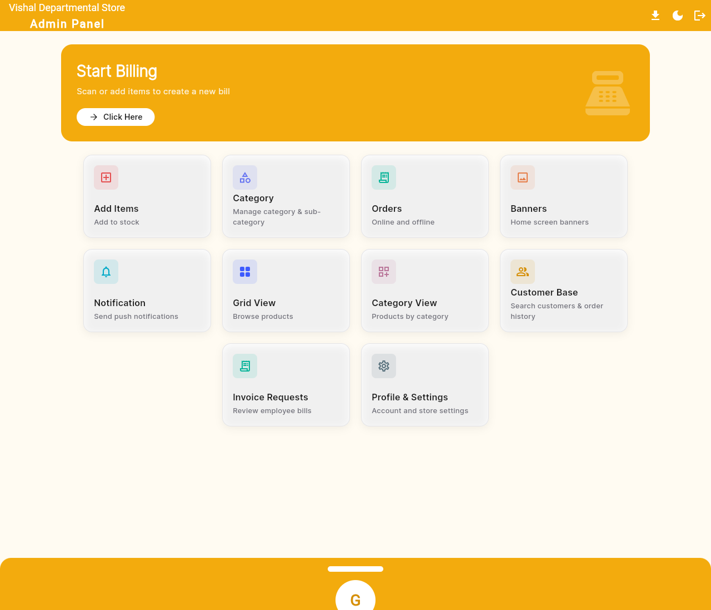
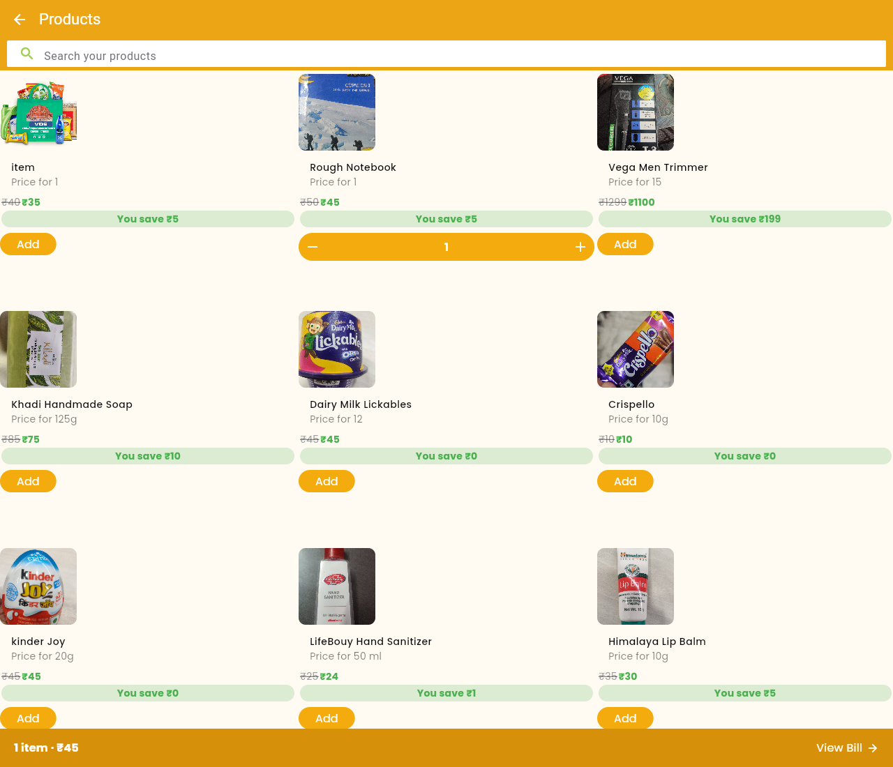
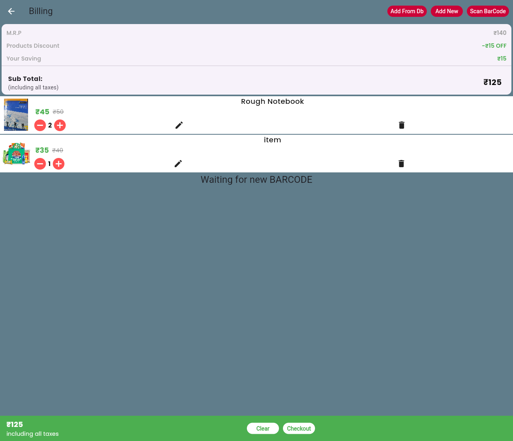
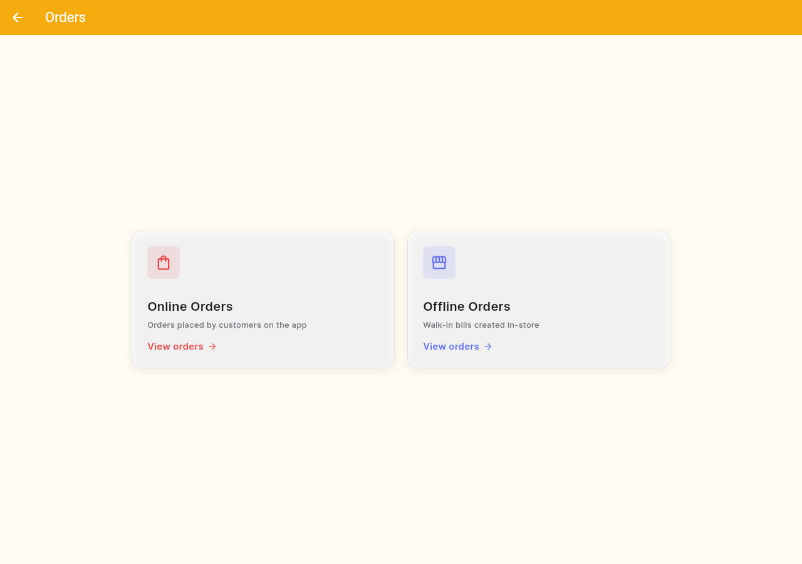
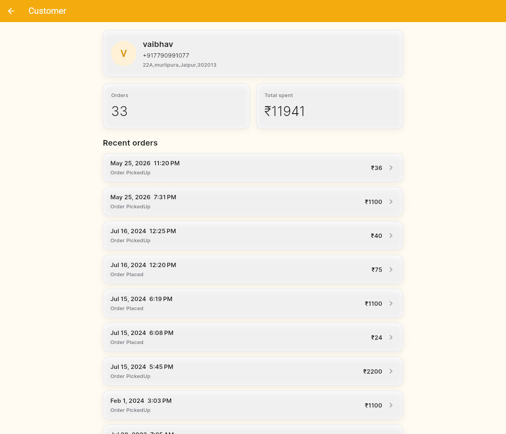
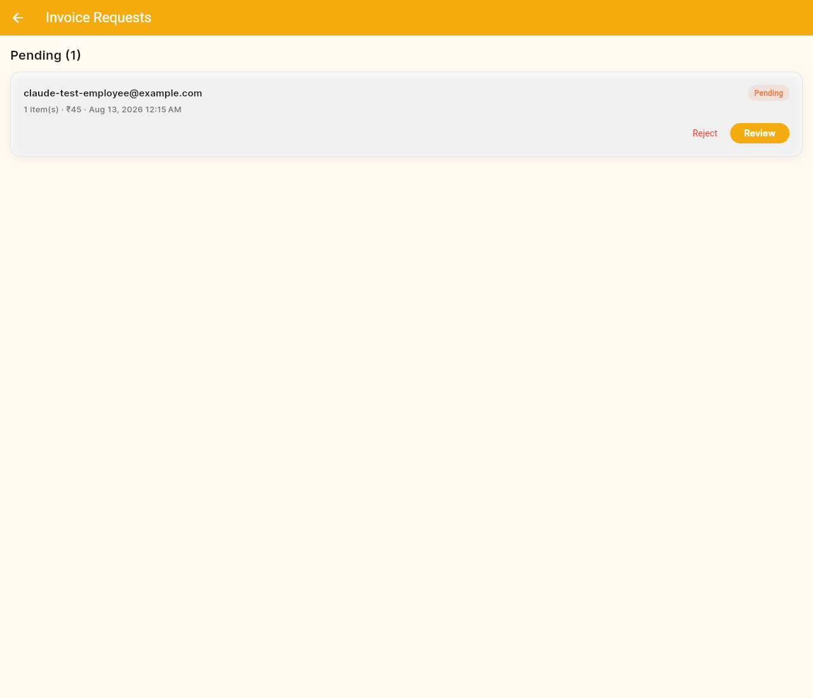
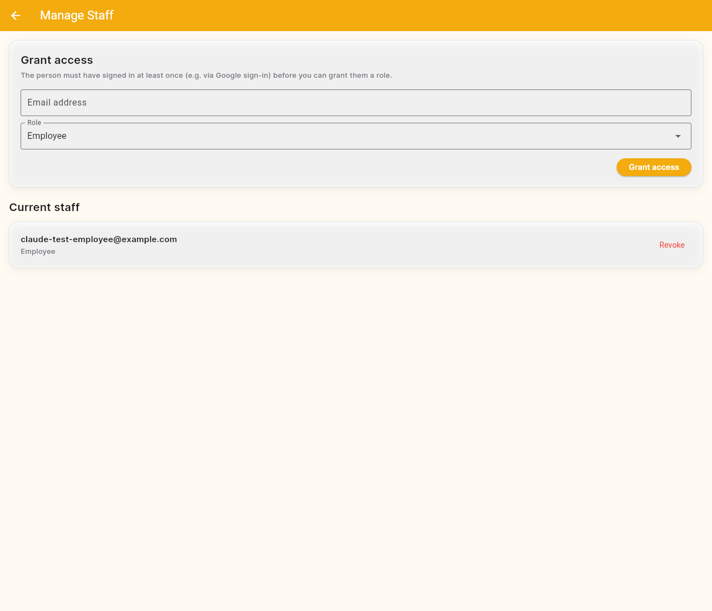
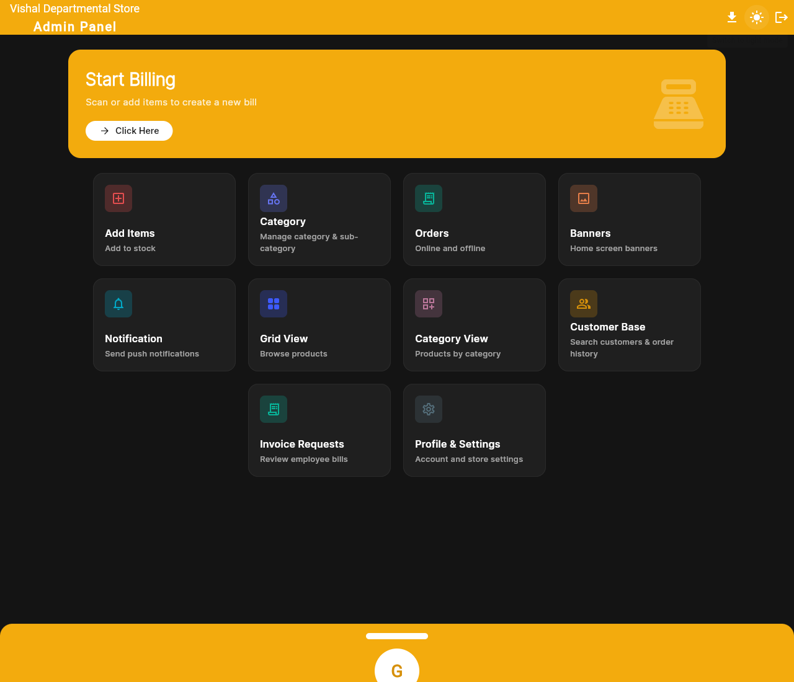
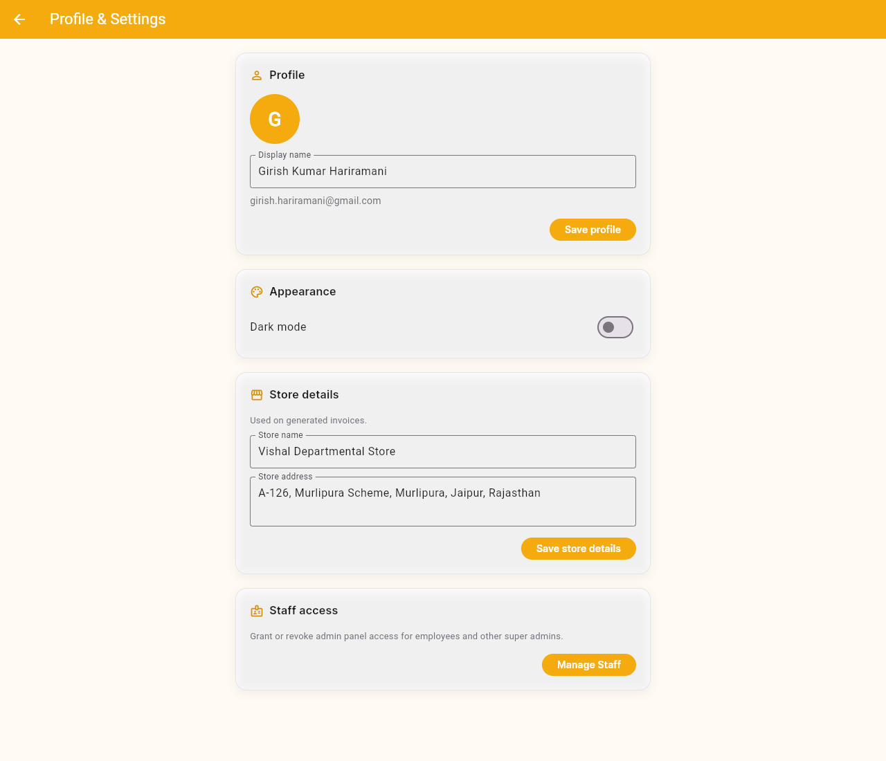

# Vishal Departmental Store — Admin Panel

A Flutter web admin panel for a departmental store's e-commerce app. Staff use it to manage the catalog, take walk-in and online orders, run in-store billing with a barcode scanner, track loyalty points, and look up customer history — all backed by Firebase.

**Live app:** https://vishal-store-admin.web.app/



## Features

### Billing & catalog
- **Start Billing** — scan a product barcode (camera or a physical USB/Bluetooth scanner) or add items manually to build a walk-in bill, generate a PDF invoice, and send it to the customer over WhatsApp.
- **Grid View** — browse the catalog visually with a live `[-] count [+]` stepper per product; the running cart total stays in sync with the invoice, with a **View Bill** shortcut once anything's in the cart.
- **Add Items / Category / Category View / Banners** — manage what customers see in the shopping app.
- **Loyalty cards** — scanning a loyalty card barcode during billing (instead of a product) looks up the customer's card and lets staff award points for that purchase.

| Grid View | Billing |
|---|---|
|  |  |

### Orders & customers
- **Orders** — separate views for online orders (placed through the shopping app) and offline/walk-in orders, each with search and pincode filtering.
- **Customer Base** — every customer aggregated from order history, searchable by name or phone, with a running total spent and full order history per customer, drilling down into the exact cart for any past order.

| Online Orders | Customer detail |
|---|---|
|  |  |

### Roles & approvals
The panel supports two staff roles:

- **Super admin** — full access: catalog management, settings, and finalizing bills directly.
- **Employee** — can use Start Billing, but instead of finalizing an invoice, submits it as a request for a super admin to review.

Super admins get an **Invoice Requests** queue to approve (which re-opens the exact same billing screen, pre-filled, so approving behaves identically to finalizing a normal bill) or reject employee-submitted bills, and a **Manage Staff** screen to grant or revoke access by email — no manual backend commands needed.

| Invoice Requests | Manage Staff |
|---|---|
|  |  |

### Everything else
- **Dark mode**, toggleable from any screen, persisted locally.
- **Profile & Settings** — edit display name, store name/address (used on generated invoices), and (for super admins) staff access.
- **Notifications** — send push notifications to the shopping app's users.

| Dark mode | Settings |
|---|---|
|  |  |

## Tech stack

- **Flutter Web**
- **Firebase**: Authentication (email/password + Google sign-in, with custom claims for role-based access), Firestore, Cloud Storage, Cloud Functions (2nd gen), Hosting
- **Firestore Security Rules** scope every collection to what the app actually needs — see `firestore.rules` context in `functions/index.js`'s comments and the `Staff`/`InvoiceRequests`/`ClubCards` collections for the access-control model
- **Cloud Functions** (`functions/`): staff role management, loyalty point awarding/redemption, WhatsApp bill delivery — all called from Flutter over plain HTTPS (this project doesn't use the `cloud_functions` plugin)
- **GitHub Actions** CI/CD: pushes to `new-changes` deploy straight to production; other branches get their own preview subdomain

## Getting started

```bash
flutter pub get
flutter run -d chrome
```

The app expects a Firebase project already configured (see `lib/firebase_options.dart` / `web/index.html`). To work on the Cloud Functions:

```bash
cd functions
npm install
firebase deploy --only functions:<functionName>   # deploy one function at a time
```

Deploying `--only functions` without a name will offer to delete any deployed function not present in this repo's `functions/index.js` — this project shares its Firebase project with a companion customer-facing app whose functions live in a different codebase, so **always scope function deploys by name**.

## Deployment

Merges to `new-changes` build and deploy automatically to the live site via GitHub Actions (`.github/workflows/`). Other branches get their own Firebase Hosting preview channel/subdomain for review before merging.
