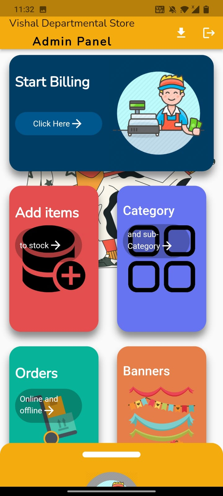
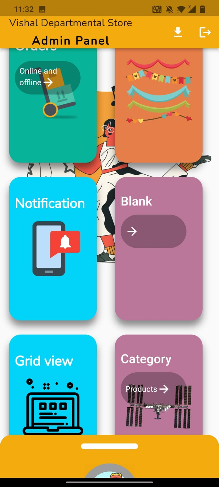
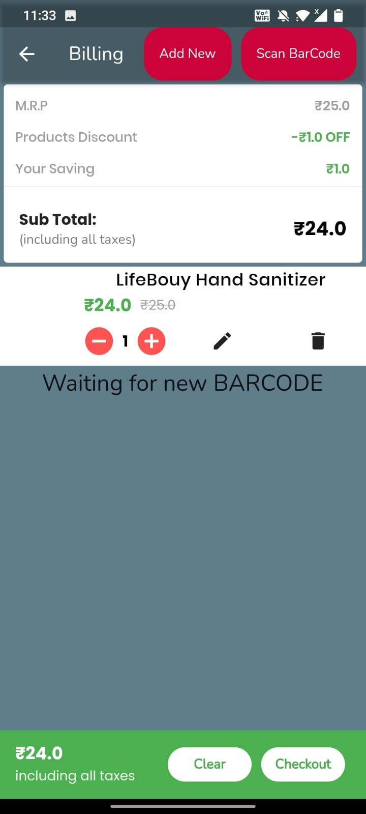
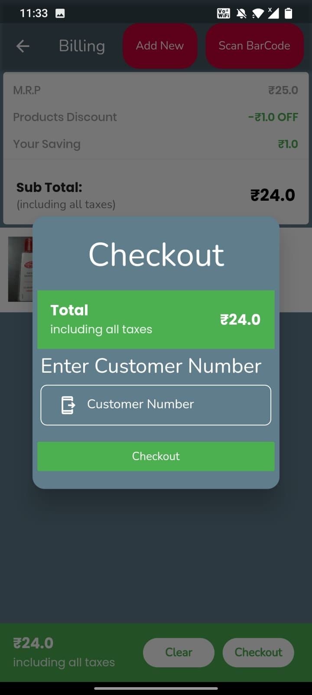
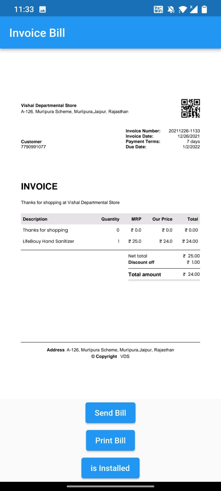
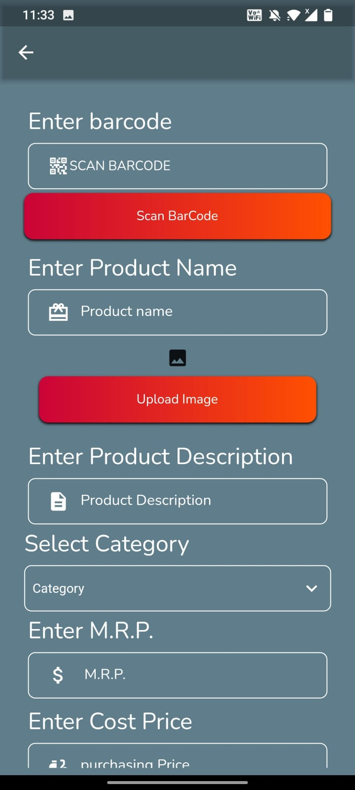
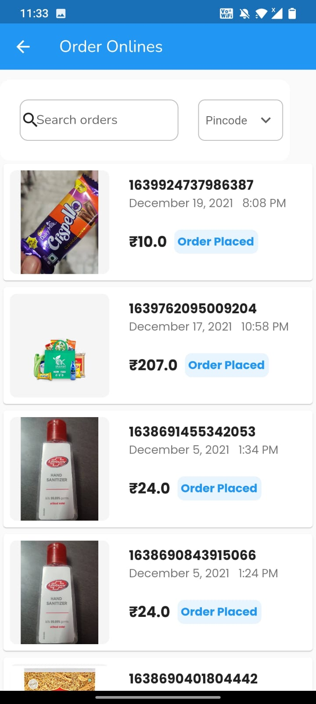
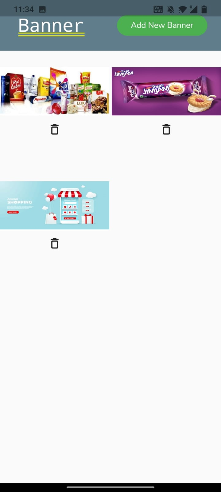
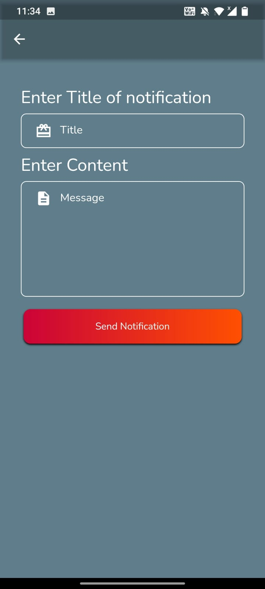

# VDS Admin Panel - Flutter Firebase E-commerce Admin
A comprehensive Flutter-based admin panel for managing e-commerce operations, built with Firebase backend services for real-time data management, image storage, and push notifications.

https://assets/screenshot/1.jpeg

## 📱 Features
- 📊 Dashboard Analytics - Real-time sales and order statistics

- 🛍️ Order Management - Complete order processing system

- 📦 Product Management - Add, edit, and manage products

- 👥 User Management - Customer and vendor management

- 📢 Push Notifications - Send notifications to users

- 🖼️ Image Management - Firebase Storage integration

- 📈 Sales Reports - Detailed analytics and reporting

- 🔐 Secure Authentication - Admin login and role management

## 🛠️ Technology Stack
- Frontend: Flutter (Dart)
- Backend: Firebase
- Authentication: Firebase Auth
- Database: Cloud Firestore
- Storage: Firebase Storage
- Push Notifications: Firebase Cloud Messaging (FCM)
- State Management: Provider
- Image Caching: Cached Network Image

## 📸 Screenshots
### Dashboard & Analytics
  
### Order Management
  
### Product Management
  
### User Management
 
## 🚀 Installation & Setup
### Prerequisites
- Flutter SDK (>=2.12.0)
- Dart (>=2.17.0)
- Firebase Project
- Android Studio / VS Code

### Step 1: Clone the Repository

```bash
git clone https://github.com/vaibhavhariramanipvt/VDS-Admin-Panel-Ecommerce-App.git

cd VDS-Admin-Panel-Ecommerce-App
```
### Step 2: Install Dependencies
```bash
flutter pub get
```

### Step 3: Firebase Setup
#### Create Firebase Project
1. Go to [Firebase Console](https://console.firebase.google.com/)

2. Create a new project or use existing one

3. Enable Authentication, Firestore, Storage, and Cloud Messaging

#### Android Configuration
1. Download `google-services.json` from Firebase Console

2. Place it in `android/app/google-services.json`

#### iOS Configuration
1. Download `GoogleService-Info.plist` from Firebase Console

2. Place it in ios/Runner/GoogleService-Info.plist

Web Configuration
Copy Firebase config from console

Update web/index.html with your Firebase config

Step 4: Environment Configuration
bash
# Copy environment template
cp .env.example .env

# Update with your Firebase configuration
# Edit .env file with your actual keys
Step 5: Run the Application
bash
# For development
flutter run

# For production build
flutter build apk --release
🔧 Firebase Configuration
Firestore Rules
javascript
rules_version = '2';
service cloud.firestore {
  match /databases/{database}/documents {
    // Admin users can read/write all data
    match /{document=**} {
      allow read, write: if request.auth != null && 
        get(/databases/$(database)/documents/admins/$(request.auth.uid)).data.isAdmin == true;
    }
  }
}
Storage Rules
javascript
rules_version = '2';
service firebase.storage {
  match /b/{bucket}/o {
    match /{allPaths=**} {
      allow read, write: if request.auth != null;
    }
  }
}
📱 Push Notifications Setup
Firebase Cloud Messaging
Enable FCM in Firebase Console

Configure notification channels for Android

Set up APNs for iOS (if needed)

Configure notification handlers in the app

Notification Types
Order Status Updates

New Order Alerts

Promotion Notifications

System Announcements

🏗️ Project Structure
```text
lib/
├── main.dart                 # App entry point
├── config/                  # Configuration files
├── models/                  # Data models
├── providers/               # State management
├── services/                # Firebase services
├── screens/                 # UI screens
│   ├── auth/               # Authentication screens
│   ├── dashboard/          # Dashboard and analytics
│   ├── orders/             # Order management
│   ├── products/           # Product management
│   ├── users/              # User management
│   └── notifications/      # Push notifications
├── widgets/                # Reusable widgets
├── utils/                  # Utilities and helpers
└── constants/              # App constants
```

### 📦 Dependencies
Core Dependencies
```yaml
dependencies:
  flutter:
    sdk: flutter
  firebase_core: ^2.24.0
  cloud_firestore: ^4.9.5
  firebase_auth: ^4.17.3
  firebase_storage: ^11.2.5
  firebase_messaging: ^14.6.5
  provider: ^6.1.1
  cached_network_image: ^3.2.3
  flutter_local_notifications: ^13.0.0
  shared_preferences: ^2.2.2
  http: ^0.13.5
  image_picker: ^1.0.4
  intl: ^0.18.1
  google_fonts: ^4.0.4
```

### 🔐 Authentication
Admin Login
Email/Password authentication

Role-based access control

Session management

Secure token handling

Security Features
Input validation

Secure API calls

Firebase Security Rules

Data encryption

📊 Dashboard Features
Real-time Analytics
Total orders count

Revenue tracking

User statistics

Product performance

Sales trends

Quick Actions
Process new orders

Manage inventory

Send notifications

View reports

🛍️ Order Management
Order Status Flow
Pending → New orders

Confirmed → Order verified

Processing → Preparing for shipment

Shipped → Out for delivery

Delivered → Order completed

Cancelled → Order cancelled

Order Actions
View order details

Update order status

Process refunds

Generate invoices

Track shipments

📦 Product Management
Product Features
Add new products

Edit existing products

Manage inventory

Set pricing

Upload product images

Category management

Image Management
Multiple image upload

Firebase Storage integration

Image compression

CDN delivery

👥 User Management
User Types
Customers - End users placing orders

Vendors - Product suppliers

Admins - System administrators

User Actions
View user profiles

Manage user accounts

Track user activity

Send user notifications

📱 Push Notifications
Notification Types
Order Updates - Status changes

Promotions - Special offers

Announcements - System updates

Alerts - Important notifications

Configuration
dart
// Initialize FCM
await FirebaseMessaging.instance.requestPermission();
await FirebaseMessaging.instance.setForegroundNotificationPresentationOptions(
  alert: true,
  badge: true,
  sound: true,
);
🚀 Deployment
Android APK
bash
flutter build apk --release
Android App Bundle
bash
flutter build appbundle --release
iOS
bash
flutter build ios --release
Web
bash
flutter build web --release
🔧 Troubleshooting
Common Issues
Firebase Configuration Errors

Verify google-services.json placement

Check Firebase project configuration

Ensure proper package name matching

Image Upload Issues

Check storage rules

Verify internet connection

Validate image format and size

Push Notification Problems

Check FCM configuration

Verify device token generation

Review notification payload

Debug Mode
bash
flutter run --debug
🤝 Contributing
Fork the repository

Create your feature branch (git checkout -b feature/AmazingFeature)

Commit your changes (git commit -m 'Add some AmazingFeature')

Push to the branch (git push origin feature/AmazingFeature)

Open a Pull Request

📄 License
This project is licensed under the MIT License - see the LICENSE.md file for details.

📞 Support
For support and queries:

📧 Email: support@vdsadmin.com

🐛 Issues: GitHub Issues

📚 Documentation: Project Wiki

🔄 Changelog
Version 1.0.0
Initial release

Basic admin panel functionality

Firebase integration

Push notifications

Built with ❤️ using Flutter & Firebase

<div align="center">
📱 Download Links
https://img.shields.io/badge/Google_Play-414141?style=for-the-badge&logo=google-play&logoColor=white
https://img.shields.io/badge/App_Store-0D96F6?style=for-the-badge&logo=app-store&logoColor=white

</div>